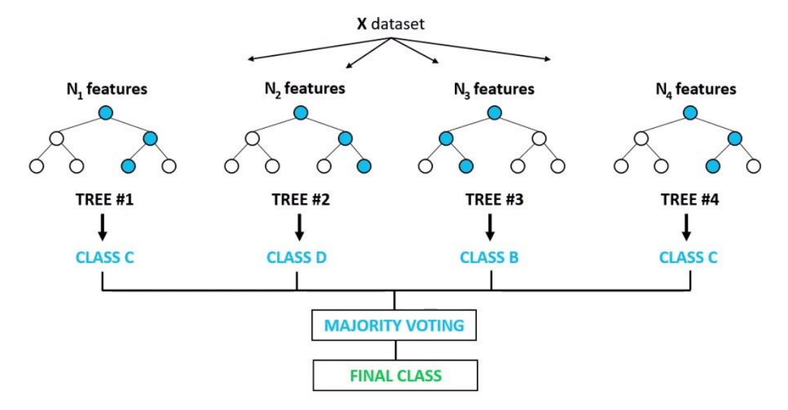

# Retail-Analytics
Walmart sales prediction with Linear Regression and Random Forests + Bayesian Structure Learning

## Dataset
The dataset is taken from [Kaggle](https://www.kaggle.com/manjeetsingh/retaildataset), and consists of 421,570 records:
* Sales_data-set.csv: sales data (2010-02-05 to 2012-11-01) from departments of all stores
* Store_data-set.csv: type and size of the stores
* Features_dataset.csv: additional data related to the stores and regions

1. **features:**

Store |	Date | Temperature	| Fuel_Price| 	MarkDown1 |	MarkDown2	| MarkDown3	| MarkDown4	| MarkDown5	| CPI	| Unemployment	| IsHoliday |
-----|---------|---------|--------|--------|--------|-----|---------|---------|--------|--------|--------|
1	| 05/02/2010	| 42.31	| 2.572	| NA	| NA	| NA	| NA	| NA	| 211.0963582 | 8.106	| FALSE|
1	|12/02/2010	|38.51	|2.548|	NA	|NA|	NA|	NA|	NA	|211.2421698|	8.106|	TRUE
1	|19/02/2010|	39.93|	2.514|	NA|	NA	|NA|	NA	|NA|	211.2891429	|8.106	|FALSE
1	|26/02/2010	|46.63|	2.56|	NA	|NA|	NA	|NA	|NA	|211.3196429	|8.106	|FALSE
1	|05/03/2010	|46.5|	2.625|	NA|	NA|	NA|	NA	|NA|	211.3501429|8.106	|FALSE

2. **sales:**

Store|	Dept|	Date|	Weekly_Sales|	IsHoliday
-----|---------|---------|--------|--------
1|	1|	05/02/2010|	24924.5|	0
1|	1|	12/02/2010|	46039.49|	1
1|	1|	19/02/2010|	41595.55|	0
1|	1|	26/02/2010|	19403.54|	0
1|	1|	05/03/2010|	21827.9|	0

3. **stores:**

Store|	Type|	Size
---|---|---
1 |A  |151315
2 |A	|202307
3	|B	|37392
4	|A	|205863
5	|B	|34875

## Models
### 1. Linear Regression
A first intuition is that a simple, easily interpretable model like LR is a good starting point for analysis. Also, this would provide a basis for future model comparisons.

* __*Refer to the [report](https://github.com/Dorsa-Arezooji/Retail-Analytics/blob/master/Retail-Analytics_report.pdf) for details and conclusions*__

### 2. Random Forests
Random forests (RFs) are primarily used for classification, however they can also be used for regression (Breiman, 2001). RFs are ensembles of decision trees (DTs), whose inputs are bootstraps of the training samples. The final RF prediction is the average of all of these DTs’ predictions for a given test sample (bootstrap aggregation). Since each DT has a different bootstrap set, the variance is reduced without affecting the bias. By using this form of aggregation, RFs generally have high accuracy (less overfitting, more robust to noise), but are less interpretable than single DTs (Zhao and Zhang, 2008).

RFs are extremely flexible and obtain very high accuracies (Pavlov, 2000) while still being prone to overfitting. Furthermore, they have embedded feature selection (Saeys, Abeel and Van de Peer, 2008), hence they can be used for strategizing feature selection. Also, they provide good estimates of the test error without repeated model training associated with cross-validation which is costly.

* __*Refer to the [report](https://github.com/Dorsa-Arezooji/Retail-Analytics/blob/master/Retail-Analytics_report.pdf) for details and conclusions*__

### Backward Feature Elimination
The feature importances calculated in the previous section (RFs) are used to eliminate features one-by-one using backward feature selection.

* The optimum selection of features is the first 6 features (Dept, Size_log, Store, week, Type, CPI), yielding an accuracy of 95.32%.
* The 2 most important features (Dept and Size_log) contribute to 91.53% of the prediction accuracy.

## **Comparison of the Models**

Model |Accuracy | Pros| Cons
------|---------|-----|----
Linear Regression | 11.56%| +simple and interpretable +trained fast| -inadequate for categorical features  -very low prediction accuracy  -extrapolating beyond the range of data is unreliable
Random Forests| 97.07%| +high prediction accuracy  +embedded feature selection  +consistent with both categorical and continuous features| -less interpretable -longer training time

## Bayesian Network Structure Learning

To explore the Bayesian Structure of the dataset, it needs to be categorized in order to reduce the dimensional complexity. [Bayesys](http://bayesian-ai.eecs.qmul.ac.uk/bayesys/) is used for learning the Bayesian structure of the dataset. The input and output files are availible via [Bayesian Learning](https://github.com/Dorsa-Arezooji/Retail-Analytics/tree/master/Bayesian%20Learning).

* __*Refer to the [report](https://github.com/Dorsa-Arezooji/Retail-Analytics/blob/master/Retail-Analytics_report.pdf) for details and conclusions*__

## References
* Breiman, L. (2001) ‘Random forests’, Machine learning, (45), pp. 5–32.
* Pavlov, Y. L. (2000) ‘Random Forests’. doi: 10.1515/9783110941975.
* Saeys, Y., Abeel, T. and Van de Peer, Y. (2008) ‘Robust Feature Selection Using Ensemble Feature Selection Techniques’, Machine Learning and Knowledge Discovery in Databases, pp. 313–325. doi: 10.1007/978-3-540-87481-2_21 .
* Zhao, Y. and Zhang, Y. (2008) ‘Comparison of decision tree methods for finding active objects’, Advances in Space Research, pp. 1955–1959. doi: 10.1016/j.asr.2007.07.020.
